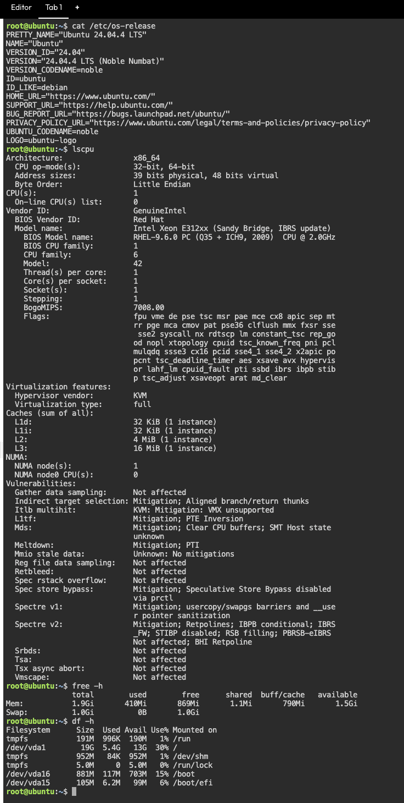

# Continue Your Linux Investigation

The KillerCoda Playground was used to inspect the basic system information of the Linux server. The investigation focused on identifying the operating system, CPU details, memory usage, and available disk space.

### Linux Commands Used

The following commands were executed to gather the required system information:

cat /etc/os-release – displays details about the installed Linux operating system.
lscpu – provides information about the server's CPU, architecture, and processing configuration.
free -h – displays the total, used, and available memory in a human-readable format.
df -h – shows the available, used, and total disk space of the system.

### Terminal Output

The screenshot below presents the output of the Linux commands executed in the KillerCoda Playground.

### Cloud Migration Recommendation

If the Linux server were migrated to a cloud environment, it could be hosted using virtual machine services from AWS, Google Cloud Platform, or Microsoft Azure.

AWS – Amazon EC2: Provides virtual machines that can run Linux operating systems, including Ubuntu, on AWS cloud infrastructure.
Google Cloud Platform – Compute Engine: Allows users to create and manage Linux-based virtual machines using Google's cloud infrastructure.
Microsoft Azure – Azure Virtual Machines: Provides scalable virtual machines that can be used to host and run Linux servers in the Azure cloud.